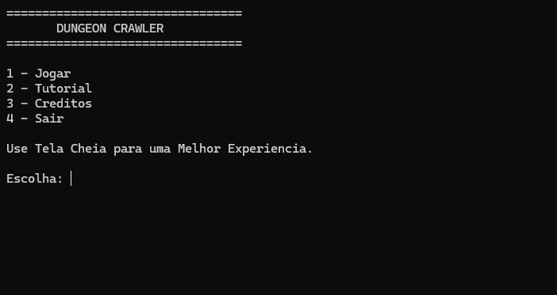
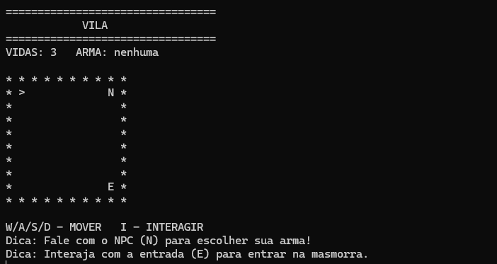
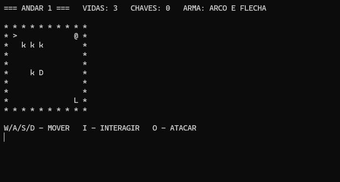
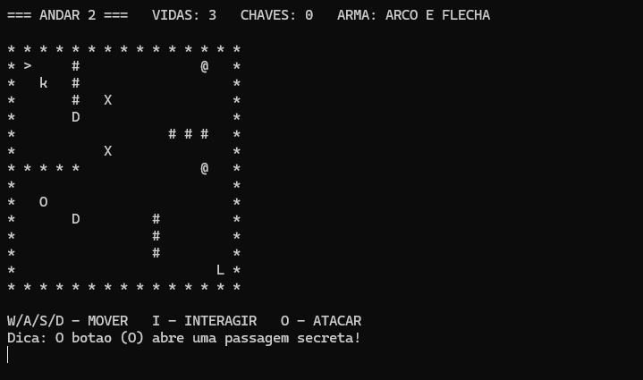

# Dungeo-Crawler-Game
## 📜 Historia
Há muitos anos, uma poderosa criatura foi derrotada e selada nas profundezas de uma antiga masmorra próxima a uma pequena vila. Durante gerações, a paz reinou e a existência da masmorra foi esquecida pelos moradores.

Recentemente, acontecimentos estranhos começaram a ocorrer. Monstros surgiram nos arredores da vila e pessoas passaram a desaparecer misteriosamente. Os anciãos descobriram que o selo que mantinha a criatura aprisionada está enfraquecendo.

Para impedir que o mal volte a se espalhar pelo mundo, um aventureiro é enviado para explorar a masmorra. Sua missão é atravessar todos os andares, resolver os desafios, derrotar os monstros que protegem o caminho e enfrentar o Boss Final escondido no último nível.

O destino da vila está em suas mãos.

O objetivo é simples, mas desafiador: escolher sua arma na vila, invadir uma masmorra perigosa, desviar de armadilhas de espinhos, derrotar monstros com padrões de IA diferentes e, finalmente, derrubar o temível Necromante no Andar 3.

---

## 📸 Telas do Jogo

  
  

 

  
  

---

## 🎮 Como Jogar & Controles

Para uma experiência visual ideal, **jogue com o terminal em tela cheia**.

### Comandos Principais
| Tecla | Ação |
| :---: | --- |
| **W** | Mover para Cima / Mudar direção do olhar para cima (`^`) |
| **S** | Mover para Baixo / Mudar direção do olhar para baixo (`v`) |
| **A** | Mover para a Esquerda / Mudar direção do olhar para a esquerda (`<`) |
| **D** | Mover para a Direita / Mudar direção do olhar para a direita (`>`) |
| **I** | **Interagir** (Falar com NPCs, abrir portas trancadas, acionar botões) |
| **O** | **Atacar** (Dispara o golpe da sua arma na direção em que está olhando) |

---

## ⚔️ Arsenal Disponível

Antes de entrar na masmorra, fale com o NPC na Vila para equipar uma das três armas místicas:

*   **1. Espada:** Perfeita para combate próximo. Desfere um golpe em uma área de $3 \times 2$ blocos imediatamente à sua frente.
*   **2. Arco e Flecha:** Ideal para covardes... digo, estrategistas! Dispara uma flecha precisa em linha reta que atinge até 4 células de distância.
*   **3. Cajado Mágico:** Magia pura. Cria uma explosão de energia elemental que atinge simultaneamente todas as 8 células adjacentes ao herói.

---

## 👾 Os Perigos da Masmorra

*   **`*` (Paredes):** Bloqueiam sua passagem.
*   **`#` (Espinhos):** Armadilhas mortais. Pisar aqui consome 1 de suas vidas e reinicia o andar.
*   **`X` (Invocações):** Monstros que se movem aleatoriamente a cada turno.
*   **`Y` (Perseguidores):** Monstros inteligentes que calculam a distância e perseguem o jogador ativamente.
*   **`Z` (O Necromante):** O Boss Final. Ele possui muita vida e invoca novos monstros `X` a cada 3 turnos se não for derrotado rapidamente.
*   **`D` / `=` (Portas):** Barreiras trancadas que exigem que você encontre a chave (`@`) no mapa para interagir (`I`) e abrir.

---

## 👥 Créditos

Este projeto foi orgulhosamente desenvolvido por:
*   **Victor Hugo**
*   **Davi Ribeiro**

---

## 🔧Ferramentas Usadas

* Auxilio Gemini Ai e Claude Ai

---

## 🚀 Como Compilar e Executar

### Pré-requisitos
*   Um compilador C instalado (como o **FALCON** ou **GCC**).
